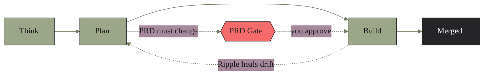
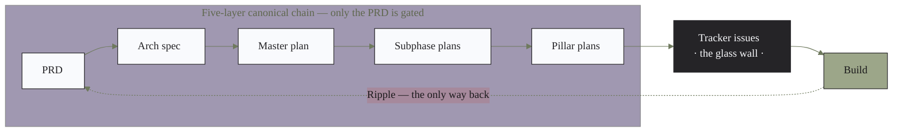
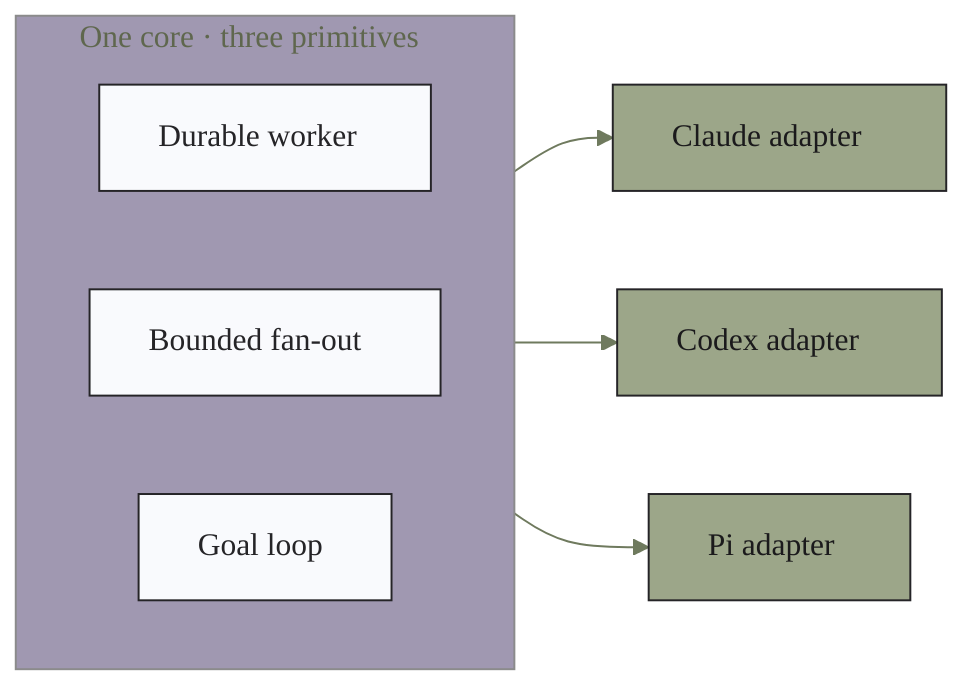

<p align="center">
  
</p>

<p align="center">
  
  
  
  
  
  
</p>

<p align="center">
  <b>A <a href="https://claude.com/claude-code">Claude Code</a> plugin that carries software from a raw idea to merged, reviewed code —</b><br>
  a guardrail-framed, tracker-driven, goal-contract pipeline. <i>Guardrails, not train tracks.</i>
</p>

---

Cast an idea into the stream at `/idc:think`; the stream carries it to merged, tested code on
its own. The only time it stops to ask is when the product's **user-facing function** is about
to change.

## Table of contents

- [What IDC is](#what-idc-is)
- [The five guardrails](#the-five-guardrails)
- [Install](#install)
- [Quickstart](#quickstart)
- [The commands](#the-commands)
- [Architecture](#architecture)
- [The board](#the-board)
- [Runtime model](#runtime-model)
- [What ships](#what-ships)
- [Developing on this plugin](#developing-on-this-plugin)
- [Repository layout](#repository-layout)
- [License](#license)

## What IDC is

IDC — the **Iterative Development Cycle** — is a pipeline with three forward stops, one
retrograde heal-path, and a single human checkpoint. Everything flows autonomously and
**automerges when green**; the process intervenes only where a real derailment would otherwise
ship.



> **Autorun** drains the whole pipe in one shot — unplanned considerations → plan → build
> eligible waves as they land → exit when nothing actionable remains. Loop it with `/loop`.

| Stage | Command | What it does | Writes |
|-------|---------|--------------|--------|
| **Think** | `/idc:think` | Free-form brainstorm (zero teammates) → one function-first consideration. | `docs/considerations/` |
| **Plan** | `/idc:plan` | Consideration → goal-contract issues: domain experts, the five-layer doc chain (only the PRD gated), matrix deconfliction, board admission. | `docs/prd/`, `docs/specs/`, `docs/plans/`, matrices, issues |
| **Build** | `/idc:build` | Executes each issue's goal contract as a goal loop; the merged review engine reviews every PR; automerge on PASS. | source, tests, review reports, tracker status |
| **Ripple** | `/idc:ripple` | Heals doc/reality drift in one PR (PR body = change order); PRD changes take the gate. | every affected canonical doc |
| **Autorun** | `/idc:autorun` | One-shot full-pipe drainer; loopable via `/loop`. | — |

## The five guardrails

IDC v2 trusts the model and keeps only the guardrails that catch real derailments. There are
exactly **five**:

| # | Guardrail | What it prevents |
|---|-----------|------------------|
| 1 | **The one PRD gate** | Product function never changes without your consent. |
| 2 | **Matrix deconfliction** | Parallel work never collides. |
| 3 | **Real verification surfaces** | Nothing merges that isn't green on genuine functional tests. |
| 4 | **Ripple drift-healing** | Docs and reality never silently diverge. |
| 5 | **One-way flow + the glass wall** | The chain stays auditable end to end. |

**The one gate.** When planning or ripple determines the PRD must change, the affected issues
land `Blocked` behind a single approval issue (a plain-terms summary + the PRD diff). You get a
push notification and approve from the GitHub web UI — on your phone. Nothing else asks for
permission.

## Install

IDC is **opt-in per repo** — its `/idc:*` commands must never appear in a repo you didn't
choose. Claude Code installs a plugin's *files* machine-wide but decides where its commands
*activate* by an enablement **scope**. So: register the marketplace once, then install at
**`project` scope** inside each repo you want governed — never the default `user` scope, which
would turn IDC on in *every* repo on the machine.

```bash
# once per machine — register the marketplace (installs/enables nothing on its own)
claude plugin marketplace add llamallamaredpajama/idc-workflow

# per repo — install AND enable for THIS repo only
cd <your-repo>
claude plugin install idc@idc-workflow --scope project
```

`--scope project` enables IDC in the repo's own `.claude/settings.json` and registers it
**disabled** (`idc@idc-workflow: false`) at the global `user` scope — an explicit off-switch,
stronger than merely being absent — so IDC stays invisible everywhere else. (Already installed
at the default `user` scope from an older version? Seal the leak with `claude plugin disable
idc@idc-workflow --scope user` — your project-scoped repos keep working.)

> **Updating.** Bump-driven: `claude plugin update idc@idc-workflow --scope project` (the
> `--scope project` matters — the bare command errors for a project install). A plugin update
> rebuilds Claude Code's version-keyed cache, so a session may need a restart to pick up new
> command definitions.

A GitHub board needs the `project` OAuth scope:
`gh auth refresh -h github.com -s project`.

## Quickstart

Start a **new** Claude Code session in the repo (so the commands load), then:

```bash
/idc:init        # idempotent scaffold: contract + config + board + receipt
/idc:doctor      # read-only health check (verifies the install)
/idc:think       # cast in your first idea
/idc:plan        # → goal-contract issues on the board
/idc:build       # drain the buildable issues to merged, reviewed code
```

`/idc:init` scaffolds the governance contract + config (filling `domains` from a codebase
scan), provisions a **5-field** GitHub Projects board **linked to this repo** — or uses the zero-setup `filesystem`
backend — enables the plugin **for this project only**, and writes an install receipt.
`/idc:doctor`'s first check fails loudly if IDC is ever enabled at the global `user` scope.

## The commands

Nine slash entry points:

| Command | Role |
|---------|------|
| `/idc:think` | brainstorm → one consideration |
| `/idc:plan` | consideration → goal-contract issues |
| `/idc:build` | issues → merged, reviewed code |
| `/idc:ripple` | heal doc/reality drift in one PR |
| `/idc:autorun` | one-shot full-pipe drainer |
| `/idc:init` | per-project scaffold (idempotent) |
| `/idc:doctor` | read-only health check |
| `/idc:update` | refresh stamped files after a plugin update |
| `/idc:uninstall` | remove IDC footprints in one revertable commit |

## Architecture

The spine everything traces to is a **five-layer canonical chain**, separated from execution
by the **glass wall** — tracker issues. Planning reaches Build *only* through issues; Build
reaches planning *only* through Ripple. The chain is auditable end to end.



**Write-authority boundaries** — each role is the sole writer of its surface and edits nothing
upstream of it. When a lower role finds a higher layer wrong, it files a Ripple and pauses only
the affected issue.

| Role | May write | Must NOT write |
|------|-----------|----------------|
| **Think** | `docs/considerations/` only | any canonical doc, tracker, source, tests |
| **Plan** | PRD, spec, master/subphase/pillar plans, pillar matrices, tracker issues | source, tests |
| **Build** | source, tests, review reports, tracker status | PRD, spec, plans |
| **Ripple** | every affected canonical doc (one PR), affected open issues | source, tests |

See [`docs/architecture.md`](docs/architecture.md) for the full picture and
[`docs/installing.md`](docs/installing.md) for detailed install + troubleshooting.

## The board

The tracker is the glass wall. Its backend is selected in `docs/workflow/tracker-config.yaml`
and hidden behind an adapter — roles never hard-code backend semantics. Two backends ship:
`github` (a GitHub Projects v2 board, first-class) and `filesystem` (a root `TRACKER.md`, zero
external setup). `/idc:init` links the github board to this repo, so it shows on the repo's
**Projects tab** and issue sidebar. The board carries **five** custom fields:

| Field | Values |
|-------|--------|
| `Status` | `Blocked` · `Todo` · `In Progress` · `Done` |
| `Stage` | `Consideration` · `Planning` · `Buildable` |
| `Wave` | `Wave N` (parallel-execution wave, matrix-assigned) |
| `Phase` | `Phase N` (master-plan phase trace) |
| `Domain` | single-select (master-plan domain trace) |

Plus native blocked-by links, an `attempt:<n>` label, and claim comments. Every issue body is a
self-sufficient **6-element goal contract**, so an outside agent can work it cold.

## Runtime model

The process is written against three abstract primitives; exactly one thin adapter per runtime
maps them to mechanics. There is no per-runtime process tree.



Model selection is **tier-symbolic** (`reasoning` / `standard` / `utility` in
`WORKFLOW-config.yaml`, resolved by the adapter at spawn time); the Codex runtime runs untiered
at highest effort. `/idc:init --codex` wires the Codex adapter
(`scripts/install-codex.sh --revert` undoes it).

## What ships

This repo is the plugin **and** its own marketplace:

- **9 commands** — the pipeline (`think · plan · build · ripple · autorun`) plus `init`,
  `doctor`, and the lifecycle pair `update` / `uninstall`.
- **8 agents** — the per-stage orchestrator playbooks, the durable-worker implementer + finisher,
  and the review coordinator + review agent.
- **13 skills** — the runtime adapters (Claude · Codex · Pi), the tracker adapter + its two
  backends, the gate-issue helper, the consideration schema, the goal-contract shape, matrix
  analysis, the schema check, the merged review engine, and ripple doc-sync.
- **`templates/`** — the per-project scaffold `/idc:init` copies into a governed repo
  (`WORKFLOW.md`, `WORKFLOW-config.yaml`, the 5-field `tracker-config.yaml`, and a lean
  `docs/workflow/` tree).

## Developing on this plugin

```bash
# live-test without installing — load the plugin for one session
claude --plugin-dir /path/to/idc-workflow

# reference integrity (namespacing, no personal paths, no dangling refs, release discipline)
bash scripts/lint-references.sh

# the functional verification suite (real round-trips, throwaway sandbox)
bash tests/smoke/run-all.sh
```

> `--plugin-dir` loads the working tree directly, bypassing Claude Code's version-keyed cache —
> the reliable way to test unreleased changes.

## Repository layout

```
.claude-plugin/   plugin.json (manifest) + marketplace.json (self-hosted marketplace)
agents/           8 agents — stage playbooks + implementer + finisher + review coordinator/agent
skills/           13 reusable procedures (runtime adapters, tracker, review engine, …)
commands/         9 slash commands (think|plan|build|ripple|autorun|init|doctor|update|uninstall)
templates/        per-project scaffold copied by /idc:init
scripts/          lint-references.sh, release check, the filesystem tracker + stage helpers,
                  install-codex.sh, run-evals.sh
tests/smoke/      the v2 functional verification suite
docs/             architecture, installing, PRD/specs/plans, developer notes, assets
llms.txt          agent-readable index of the whole plugin
```

## License

[MIT](LICENSE) © 2026 llamallamaredpajama

<p align="center">
  <br>
  
  <br><br>
  <sub>Visual identity adapted from the industrial-chic aesthetic of <a href="https://www.coalhouse.co.uk">Coal House, Cardiff</a> — coal-black ink, sage, and coral, set in the Johnston/Gill lineage.</sub>
</p>
