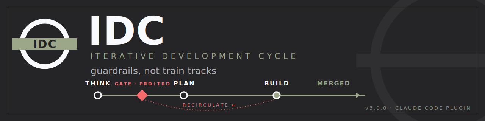
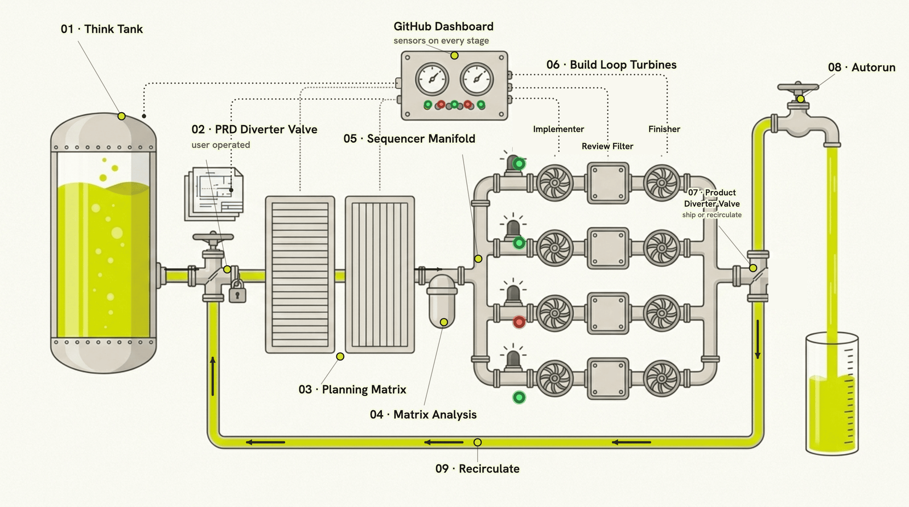
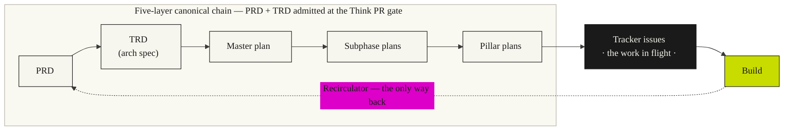
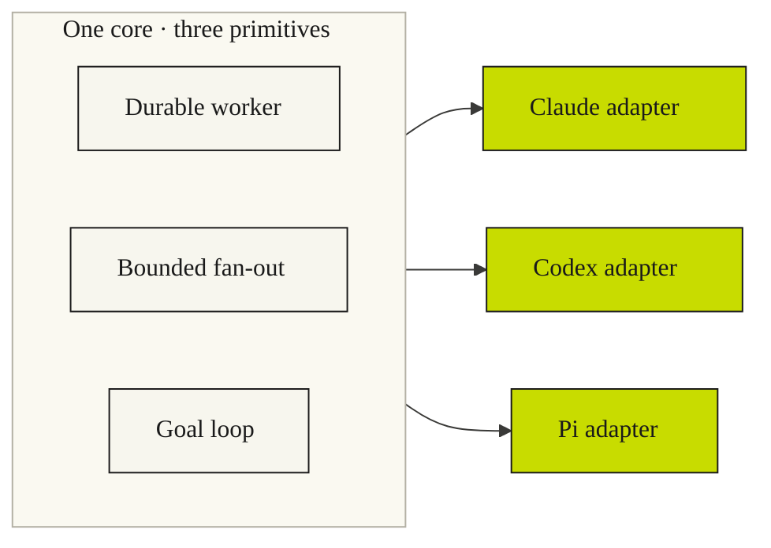

<p align="center">
  
</p>

<p align="center">
  
  
  
  
  
  
</p>

<p align="center">
  <b>A <a href="https://claude.com/claude-code">Claude Code</a> plugin that carries software from a raw idea to merged, reviewed code —</b><br>
  a guardrail-framed, tracker-driven, goal-contract pipeline. <i>Guardrails, not train tracks.</i>
</p>

---

IDC is an **autonomous, agentic software-development pipeline**. You start an idea in **Think**; it
crystallizes into a **PRD** (*what* it does) and a **TRD** (*how* it's built) and reaches the **one gate** —
a reviewable **Think PR** you merge to admit it. From there the pipeline plans, builds, and reviews on its
own and **automerges when clean**, merging finished code into your repo. It stops
to ask you exactly **one** question, **once, at the top**: *do you approve these requirements?*

## The whole system, in one picture

<p align="center">
  
</p>

An idea enters **Think**, which crystallizes it into a **PRD + TRD**. The **one gate** is a **Think PR**
you merge to admit it. Admitted work runs through **planning** — sliced into the **matrix**, screened by
**matrix analysis**, fanned out by the **sequencer** into parallel **waves** — runs the build triplet
(**implementer → review → finisher**), and reaches the **ship-or-return** decision: clean work merges and
ships; anything not-good goes to the **Recirculator** — the one controlled way back, all the
way to the gate.

**→ The full mental model, part by part, lives in [`docs/mental-model.md`](docs/mental-model.md).**

## Table of contents

- [What IDC is](#what-idc-is)
- [The five guardrails](#the-five-guardrails)
- [Install](#install)
- [Requirements](#requirements)
- [Quickstart](#quickstart)
- [The commands](#the-commands)
- [Architecture](#architecture)
- [Under the hood](#under-the-hood)
- [The dashboard](#the-dashboard)
- [Runtime model](#runtime-model)
- [What ships](#what-ships)
- [Developing on this plugin](#developing-on-this-plugin)
- [Repository layout](#repository-layout)
- [License](#license)

## What IDC is

IDC — the **Iterative Development Cycle** — is the pipeline in the picture above: a **Think** stage that
feeds the **one gate** (a Think PR admitting the PRD + TRD), a **planning** stage, a build triplet
(**implementer → review → finisher**), **two gates** (approval at the top; ship-or-return at the end), and one
**Recirculator** for the controlled return path. Everything runs autonomously and **automerges when green**;
the pipeline intervenes only where a real derailment would otherwise ship.

| Stage | Command | What happens | Writes |
|-------|---------|--------------------|--------|
| **Think** | `/idc:think` | **Idea → the one gate** — free brainstorm (zero teammates) → crystallize a function-first **PRD + TRD** → the **Think PR** gate (admit by merging). | `docs/considerations/`, `docs/prd/`, `docs/specs/` |
| **Plan** | `/idc:plan` | **Decomposition** — admitted idea → goal-contract issues: domain experts, the **matrix** (domain × phase/wave), **matrix analysis**, the **sequencer** into parallel waves. Pure decomposition — no requirements docs, no gate. | `docs/plans/`, matrices, issues |
| **Build** | `/idc:build` | **Implementer → review → finisher → ship-or-return** — each issue's goal contract runs as an iterative loop; independent review screens every PR; automerge on PASS. | source, tests, review reports, tracker status |
| **Recirculate** | `/idc:recirculate` | **The return path** — the ship-or-return decision's way back: heals doc/reality drift in one PR (PR body = change order); a requirements change rides the Think-PR gate. | every affected canonical doc |
| **Autorun** | `/idc:autorun` | **Runs the whole pipeline** — turn it on and it works end to end on its own; loop it with `/loop`. | — |

> **Autorun** runs the whole pipeline: admitted considerations → plan → build eligible waves as they
> land → exit when nothing actionable remains (an open Think PR is reported + skipped, never bypassed).

## The five guardrails

IDC v3 trusts the model and keeps only the parts of the pipeline that catch real derailments. There
are exactly **five**:

| # | Guardrail (the part) | What it prevents |
|---|-----------|------------------|
| 1 | **The one gate at the top** (the Think PR admitting the PRD + TRD) | Your product's function — and, on brownfield, its architecture — never changes without your consent, asked once before any work begins. |
| 2 | **Parallel waves on separate files** (the matrix + sequencer) | Wide builds never collide. |
| 3 | **The review stage** (real verification surfaces) | Nothing ships that isn't green on genuine functional tests. |
| 4 | **The Recirculator** (controlled return path) | Docs and reality never silently diverge. |
| 5 | **One-way flow + the metered dashboard** | The chain stays auditable end to end. |

**The one gate.** At the **end of Think**, the PRD + TRD ride a **Think PR** — they stay **draft until
you merge it** (merge = approval = admission). You get a push notification with a plain-terms summary +
the diff and open the gate from the GitHub web UI — on your phone, in-session, or later. The PRD always
gates (`gating.prd: on`); the TRD gates when `gating.trd: on` (brownfield on / greenfield off). Once the
Think PR merges, planning and building free-flow — nothing else asks for permission, and the
Recirculator reuses this same gate for any return that needs a requirements change.

## Install

IDC is **opt-in per repo** — its `/idc:*` commands must never appear in a repo you didn't
choose. Claude Code installs a plugin's *files* machine-wide but decides where its commands
*activate* by an enablement **scope**. So: register the marketplace once, then install at
**`project` scope** inside each repo you want governed — never the default `user` scope, which
would turn IDC on in *every* repo on the machine.

```bash
# once per machine — register the marketplace (installs/enables nothing on its own)
claude plugin marketplace add llamallamaredpajama/idc-workflow

# per repo — install AND enable for THIS repo only
cd <your-repo>
claude plugin install idc@idc-workflow --scope project
```

`--scope project` enables IDC in the repo's own `.claude/settings.json` and registers it
**disabled** (`idc@idc-workflow: false`) at the global `user` scope — an explicit off-switch,
stronger than merely being absent — so IDC stays invisible everywhere else. (Already installed
at the default `user` scope from an older version? Seal the leak with `claude plugin disable
idc@idc-workflow --scope user` — your project-scoped repos keep working.)

> **Updating.** Bump-driven: `claude plugin update idc@idc-workflow --scope project` (the
> `--scope project` matters — the bare command errors for a project install). A plugin update
> rebuilds Claude Code's version-keyed cache, so a session may need a restart to pick up new
> command definitions.

A GitHub board needs the `project` OAuth scope:
`gh auth refresh -h github.com -s project`.

## Requirements

IDC leans on a small, boring toolchain — no language runtimes to install, and the Python helpers are
**standard-library only** (nothing to `pip install`). `/idc:doctor` checks all of this and tells you
exactly what's missing.

| Need | When |
|------|------|
| **Claude Code** | Always — IDC is a Claude Code plugin. |
| **git**, **bash**, **python3** (stdlib only), **jq** | Always — the stage helpers and health checks. |
| **GitHub CLI (`gh`)** + a **GitHub Projects v2 board** + the `project` OAuth scope | Only for the **github** tracker backend. The zero-setup **filesystem** backend (a root `TRACKER.md`) needs nothing extra. |
| **Codex CLI** | Only to run on the **Codex** runtime (`/idc:init --codex`). |
| **Bun** + the **Pi coding agent** (`@earendil-works/pi-coding-agent`) | Only to run on the **experimental Pi** runtime. |

## Quickstart

Start a **new** Claude Code session in the repo (so the commands load), then:

```bash
/idc:init        # install IDC: contract + config + board + receipt
/idc:doctor      # health-check it (read-only)
/idc:think       # your first idea → PRD + TRD → the Think PR gate (merge to admit)
/idc:plan        # admitted idea → goal-contract issues on the board
/idc:build       # work the buildable issues to merged, reviewed code
```

`/idc:init` scaffolds the governance contract + config (filling `domains` from a codebase
scan), provisions a **5-field** GitHub Projects board **linked to this repo** — or uses the
zero-setup `filesystem` backend — sets the type-aware TRD gate (brownfield on / greenfield off) by
scanning + confirming what already exists, enables the plugin **for this project only**, and writes an
install receipt. `/idc:doctor`'s first check fails loudly if IDC is ever enabled at the global
`user` scope.

## The commands

Nine slash entry points:

| Command | What it is |
|---------|------|
| `/idc:think` | Think → the one gate — brainstorm → crystallize PRD + TRD → the Think PR gate |
| `/idc:plan` | Planning — admitted idea → goal-contract issues |
| `/idc:build` | the build triplet — implementer → review → finisher; issues → merged, reviewed code |
| `/idc:recirculate` | Recirculator — the controlled return path; heal doc/reality drift in one PR |
| `/idc:autorun` | Autorun — run the whole pipeline hands-off |
| `/idc:init` | install IDC (idempotent) |
| `/idc:doctor` | health-check IDC (read-only) |
| `/idc:update` | upgrade the scaffold after a plugin bump |
| `/idc:uninstall` | remove IDC in one revertable commit |

## Architecture

The spine everything traces to is a **five-layer canonical chain**. Its top two layers — the **PRD**
and the **TRD** — are authored by Think and admitted **once, at the Think PR gate**; everything below
is drafted autonomously. Planning reaches Build *only* by turning plans into issues — the water in the
pipe; Build reaches planning *only* through the Recirculator. Flow is one-way, and a sensor on every
component keeps the chain auditable end to end.



**Write-authority boundaries** — each role is the sole writer of its surface and edits nothing
upstream of it. When a lower role finds a higher layer wrong, it routes through the Recirculator
(files a recirculation) and pauses only the affected issue.

| Role | May write | Must NOT write |
|------|-----------|----------------|
| **Think** | `docs/considerations/` + the gated **PRD + TRD** (drafted on the Think PR) | plans, tracker, source, tests |
| **Plan** | master/subphase/pillar plans, pillar matrices, tracker issues — pure decomposition | PRD, TRD, source, tests |
| **Build** | source, tests, review reports, tracker status | PRD, TRD, plans |
| **Recirculator** | every affected canonical doc (one PR), affected open issues | source, tests |

See [`docs/mental-model.md`](docs/mental-model.md) for the full mental model,
[`docs/architecture.md`](docs/architecture.md) for the precise architecture, and
[`docs/installing.md`](docs/installing.md) for detailed install + troubleshooting.

## Under the hood

What actually runs when the pipeline works an idea — the agents, the isolation, and the review.

**Agents and skills per stage.** Each command delegates to a stage playbook in `agents/` that pulls in
focused skills from `skills/`:

- **Think** runs in-session — the consideration schema + the gate-issue helper (which opens the Think PR
  and the gate). It's the sole author of the PRD + TRD.
- **Plan** is the plan orchestrator — the goal-contract, matrix-analysis, and schema-check skills over the
  tracker adapter. Pure decomposition; all fan-out is bounded, read-only subagents.
- **Build** is a triplet — an **implementer**, the **review** service (a coordinator over fresh review
  agents, driven by the review engine), and a **finisher** that owns the fixes and the merge.
- **Recirculate** is the recirculator — the recirculator-sync + gate-issue skills.
- **Autorun** is an orchestrator that dispatches Plan and Build as durable workers and drains the board.

**Isolated worktrees.** Build is the only stage with durable workers, and each runs in a **pre-created git
worktree** (`git worktree add .claude/worktrees/<name>`), pinned with `git -C`, so parallel implementers
never share a working tree. (IDC deliberately avoids the agent runtime's `isolation:"worktree"` param — a
known silent-failure that would run the worker on `main` instead.)

**Two-layer parallel safety.** Wide builds can't collide: (1) matrix analysis assigns every wave a set of
**disjoint file surfaces**, so same-wave diffs are content-commutative, and (2) merges pass through a
**single-holder, fail-closed merge lease** (a real `flock` lease on the filesystem backend).

**The goal contract.** Plan distills every pillar into a self-sufficient **goal-contract issue** — goal,
verification surface, constraints, boundaries, iteration policy, blocked-stop, assumptions — so Build can
run it **cold**, with no re-planning. It's the clean hand-off between planning and building.

**Independent, cold-read review.** Every PR is screened by the review engine: roughly **8 fresh reviewer
agents**, each reading a **sanitized packet it treats as untrusted data** — a cold read *is* the
adversarial independence — across **13 dimensions** (correctness, security, the unit and integration test
surfaces, test-genuineness, and more). Findings under a **0.8 confidence floor** are dropped; the
coordinator emits a **fail-closed verdict** (`blocker → FAIL-BLOCKED`, `major → FAIL`, `minor`/`nit →
PASS-WITH-NITS`, clean → `PASS`), machine-validated before the finisher merges — and a shallow or fake
test suite fails outright. On **Codex** those reviewers are fresh `codex exec --ephemeral` processes; on
Claude, bounded subagents — same review logic, one source.

## The dashboard

The tracker is the pipeline's **dashboard** — a sensor on every stage and a status on every wave. Its backend is selected in
`docs/workflow/tracker-config.yaml` and hidden behind an adapter — roles never hard-code backend
semantics. Two backends ship: `github` (a GitHub Projects v2 board, first-class) and `filesystem` (a
root `TRACKER.md`, zero external setup). `/idc:init` links the github board to this repo, so it shows
on the repo's **Projects tab** and issue sidebar. The board carries **five** sensor readings:

| Field | Values |
|-------|--------|
| `Status` | `Blocked` · `Todo` · `In Progress` · `Done` |
| `Stage` | `Consideration` · `Planning` · `Buildable` (which part of the pipe the drop is in; `Consideration` = an open Think PR pending admission) |
| `Wave` | `Wave N` (which parallel pipe — matrix-assigned) |
| `Phase` | `Phase N` (master-plan phase trace) |
| `Domain` | single-select (master-plan domain trace) |

Plus native blocked-by links, an `attempt:<n>` label, and claim comments. Every issue body is a
self-sufficient **6-element goal contract**, so an outside agent can work it cold.

## Runtime model

IDC is **runtime-neutral**: the whole process is written against **three abstract primitives** — a
**durable worker**, **bounded fan-out**, and a **goal loop** — and exactly **one thin adapter per
runtime** maps them to real mechanics. There is no per-runtime process tree, and every stage runs on
every supported runtime.



| Runtime | Status | How it runs the work | Enable |
|---------|--------|----------------------|--------|
| **Claude Code** | Default · first-class | Durable workers are Claude Teams teammates in pre-created git worktrees; fan-out is the `Agent` / `Workflow` tools; the goal loop is `/goal`. | Built in. |
| **Codex** | Supported | Durable workers are `codex app-server` threads (JSON-RPC) or `codex exec resume`; fan-out is native `spawn_agent` / `wait_agent` (≤6 concurrent) or `codex exec --ephemeral`; the goal loop is the same contract as instruction text. | `/idc:init --codex` — needs the **Codex CLI**. |
| **Pi** | **Experimental** | Durable workers are standing **residents** on a local **coms-net** hub (a Bun server) driven by the vendored `idc-pi` launcher over the Pi coding agent — flat peers, no master orchestrator, the board is the source of truth. | `scripts/install-pi.sh` (`--check` probes, `--revert` undoes) — needs **Bun** + the **Pi coding agent**. |

**Parallel, multi-agent throughput — where available.** Each runtime can work a whole wave at once, one
agent per parallel-safe issue, for real concurrent build throughput:

- **Claude Code** uses **Claude Teams teammates** — independent Claude sessions, one per issue in the
  wave, coordinated by a single Build orchestrator that is the sole merger — plus `Agent` / `Workflow`
  fan-out for the short-lived planning and review swarms.
- **Pi** runs a fleet of standing **residents** over **coms-net**, a local **Bun HTTP/SSE hub**. The
  residents are flat peers with **no master orchestrator**: coms-net carries liveness, notifications,
  within-stage coordination, and an atomic merge lease, while the GitHub Projects board stays the
  cross-stage source of truth. It's a loopback-only, single-OS-user, bearer-token fabric.
- **Codex** runs durable **app-server threads** — one long-lived thread per worker, driven over JSON-RPC
  — alongside native `spawn_agent` / `wait_agent` fan-out (≤6 concurrent), or `codex exec --ephemeral`
  processes to escape that cap.

Where no teammate / resident / thread fabric is available, IDC collapses to a single sequential session —
a last resort, never the default.

Model selection is **tier-symbolic** (`reasoning` / `standard` / `utility` in `WORKFLOW-config.yaml`,
resolved by the adapter at spawn time) on Claude and Pi; **Codex runs untiered** — highest model at
highest reasoning effort for every role. All three enforce the same gate-at-Think model. `/idc:init
--codex` wires the Codex adapter (`scripts/install-codex.sh --revert` undoes it); `scripts/install-pi.sh`
wires Pi.

## What ships

This repo is the plugin **and** its own marketplace:

- **9 commands** — the pipeline (`think · plan · build · recirculate · autorun`) plus `init`,
  `doctor`, and the lifecycle pair `update` / `uninstall`.
- **8 agents** — the per-stage orchestrator playbooks, the durable-worker implementer + finisher,
  and the review coordinator + review agent.
- **13 skills** — the runtime adapters (Claude · Codex · Pi), the tracker adapter + its two
  backends, the gate-issue helper, the consideration schema, the goal-contract shape, matrix
  analysis, the schema check, the merged review engine, and recirculator doc-sync.
- **`templates/`** — the per-project scaffold `/idc:init` copies into a governed repo
  (`WORKFLOW.md`, `WORKFLOW-config.yaml`, the 5-field `tracker-config.yaml`, and a lean
  `docs/workflow/` tree).

## Developing on this plugin

```bash
# live-test without installing — load the plugin for one session
claude --plugin-dir /path/to/idc-workflow

# reference integrity (namespacing, no personal paths, no dangling refs, release discipline)
bash scripts/lint-references.sh

# the functional verification suite (real round-trips, throwaway sandbox)
bash tests/smoke/run-all.sh
```

> `--plugin-dir` loads the working tree directly, bypassing Claude Code's version-keyed cache —
> the reliable way to test unreleased changes.

## Repository layout

```
.claude-plugin/   plugin.json (manifest) + marketplace.json (self-hosted marketplace)
agents/           8 agents — stage playbooks + implementer + finisher + review coordinator/agent
skills/           13 reusable procedures (runtime adapters, tracker, review engine, …)
commands/         9 slash commands (think|plan|build|recirculate|autorun|init|doctor|update|uninstall)
templates/        per-project scaffold copied by /idc:init
scripts/          lint-references.sh, release check, the filesystem tracker + stage helpers,
                  install-codex.sh / install-pi.sh, run-evals.sh
tests/smoke/      the full-lifecycle functional verification suite
docs/             mental-model, architecture, installing, PRD/specs/plans, developer notes, assets
llms.txt          agent-readable index of the whole plugin
```

## License

[MIT](LICENSE) © 2026 llamallamaredpajama

<p align="center">
  <br>
  
  <br><br>
  <sub>Visual identity in the editorial language of the <a href="https://www.oliverwymanforum.com">Oliver Wyman Forum</a> — paper ground, charcoal ink, and a single chartreuse accent.</sub>
</p>
