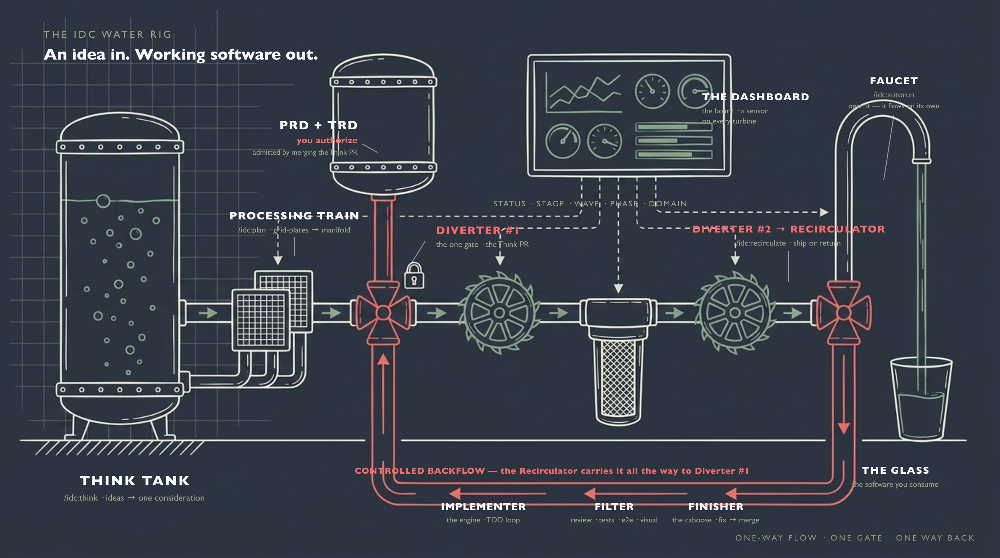

# The IDC mental model — the water rig

> One picture for the whole system. IDC is a **water rig**: an idea goes in one end, working
> software comes out the other, and the flow only ever stops to ask you one question — at the top.

  

The hero above is a painted blueprint of the rig with a **native-vector label layer** — so
every label stays perfectly crisp and editable (it never garbles or drifts from the words below).
Sources: [`assets/mental-model-hero.svg`](assets/mental-model-hero.svg) (the labels) over
[`assets/mental-model-hero-base.png`](assets/mental-model-hero-base.png) (the painting). A fully
vector alternate lives at
[`assets/mental-model-hero-vector.svg`](assets/mental-model-hero-vector.svg).

## The one-sentence version

You drop an idea into the **Think Tank**. When it firms up, Think writes down **what** it does (the
**PRD**) and **how** it's built (the **TRD**) and carries both to the **first Diverter** — *the one
gate*, a reviewable **Think PR** that **only you** can open. Merge it and the idea is admitted. From
there the work runs through the **processing train** — sliced on two **grid-plates** into the
**matrix**, screened by the **matrix-analysis filter**, and fanned out by the **sequencer manifold**
into parallel **waves**. Each wave spins a **build triplet** of **turbines** — *implementer → review
filter → finisher* — and hits the **second Diverter**: clean water pours out the **Faucet** into your
**Glass**; anything not-good goes to the **Recirculator**, the one controlled way back, which carries
it all the way up to the first Diverter again. The flow runs **one way**, and every part reports to
the **dashboard**.

That's the whole system. Everything below is just naming the parts.

## The parts (and what each one really is)

| Part of the rig | What it actually is in IDC | Command / file |
|---|---|---|
| 🛢️ **Think Tank** | Free brainstorming. Your ideas float here with no gates and no pressure, until one firms up — then Think crystallizes it into a **PRD** (*what* it does) and a **TRD** (*how* it's built). | `/idc:think` → `docs/considerations/`, `docs/prd/`, `docs/specs/` |
| ╳ **Diverter #1** *(the one gate)* | The single human checkpoint, at the **end of Think**: a reviewable **Think PR** carrying the PRD + TRD. They stay **draft until you merge** — **merge = approval = admission**. Approve in-session or later from your phone. **Nothing else in the rig ever asks you for anything.** | the Think PR (`idc:idc-gate-issue`) |
| 🔒 **PRD** | The one document that says **what your product does for its users**. The valve to it is **locked** — it's gated by default (`gating.prd: on`), opened only by you. | `docs/prd/` |
| 📐 **TRD** | The technical design — **how** it's built (the old `spec` layer, elevated to a gateable doc). Gated when `gating.trd: on` — **on for brownfield** (protect an established stack from silent re-architecture), **off for greenfield** (let architecture flex). | `docs/specs/` |
| 💧 **Water in the pipe** | The work itself — an admitted idea, then the issues it becomes — flowing downstream. | the board's items |
| 🚂 **Processing train** *(planning)* | Turns an admitted idea into buildable packets — **no turbines here, it's processing, not a loop.** | `/idc:plan` |
| ▦ **The two grid-plates → the matrix** | Planning slices the work twice: **grid-plate #1** by *domain* (which area of the product), **grid-plate #2** by *phase/wave*. The two slices together are the **matrix**. | `/idc:plan` |
| ▒ **Matrix-analysis filter** | Pairwise clash deconfliction over the matrix — it proves no two packets touch the same files, then cuts the work into discrete buildable goal-contract issues. | `idc:idc-matrix-analysis` |
| ⛓ **Sequencer manifold** | Splits the deconflicted packets into **parallel pipes = waves**. Each pipe carries its own slice of work, so the streams never cross-contaminate. | the matrix sequencing |
| ⊙ **Implementer turbine** | "The engine." Pulls a buildable issue off the board and writes the code in a test-first **iterative loop** (a turbine = an iterative loop, and loops only live in Build). | `/idc:build` (implementer) |
| ▒ **Review filter** | Independent review + the real test surfaces (unit, e2e, agentic visual). Only **clean water passes** — nothing ships that isn't green. | the review engine |
| ⊙ **Finisher turbine** | "The caboose." Works the review filter's findings in a loop (fix → re-review → simplify), then **merges**. It is the one part that talks to the second Diverter. | `/idc:build` (finisher) |
| ╳ **Diverter #2** *(ship or return)* | At the end of Build the finisher routes the flow: **clean** → out the Faucet into the Glass; **not-good** → into the **Recirculator**. | the finisher's ship/return decision |
| ▶ **Recirculator** | The single controlled **backflow**, and the only way back. When a finding can only be fixed *upstream*, the Recirculator carries it all the way to Diverter #1, deciding en route: **within the PRD/TRD's bounds** → re-plan and free-flow again; **needs a requirements change** → a new gated Think PR. | `/idc:recirculate` |
| 🚰 **Faucet** | Open it and the whole rig runs on its own — draining every idea in the tank to shipped software, hands-off. (Run the stages by hand and you're just working the faucet manually.) | `/idc:autorun` |
| 🥛 **The Glass** | The running software you actually consume. Clean water in the glass = working features in your hands. | your shipped app |
| 📺 **Dashboard + sensors** | The tracker board. It isn't part of the plumbing — it's **instrumentation bolted onto it**: a sensor on every component and a **status light on every wave-pipe**. Its readouts (`Status · Stage · Wave · Phase · Domain`) tell you where every drop is. | the board |

## Following one drop through the rig

1. **It starts in the tank.** You talk an idea through at `/idc:think` until it firms up. Think then
   writes down *what the software should do for you* (the **PRD**) and *how it's built* (the **TRD**).
2. **It hits Diverter #1 — the one gate.** Think opens a **Think PR** carrying the PRD + TRD and lands
   a plain-language summary plus the exact change on your phone. The docs stay **draft until you merge
   the PR**: merging *is* the approval that admits the idea. Leave it open and it's just a saved idea
   waiting on you. **This is the only place the whole rig ever asks you for anything.**
3. **Admitted, it enters the processing train.** `/idc:plan` slices the work on two **grid-plates**
   (domain, then phase/wave) into the **matrix**, runs the **matrix-analysis filter** to prove nothing
   collides, cuts it into buildable issues, and the **sequencer manifold** fans them into parallel
   **waves**. No gate here — admission already happened at the top.
4. **Each wave spins the build triplet.** The **Implementer turbine** writes the code in a loop; the
   **review filter** screens it with independent review and real tests; the **Finisher turbine**
   clears every finding and merges.
5. **It reaches Diverter #2 — ship or return.** Clean water flows out the **Faucet** into the
   **Glass**. If the finisher finds a problem that's really upstream, the flow goes to the
   **Recirculator** instead, which carries it *all the way back to Diverter #1* — and decides:
   fix it within the approved PRD/TRD (re-plan, free flow), or is this a requirements change that needs
   a new gated Think PR?
6. **It pours into the Glass.** Out the **Faucet** comes merged, tested, working software.

## Inside the build — the turbine triplet

The build section is the **only** place with turbines (a turbine = an iterative loop). It's a
**triplet**: two turbines with the review filter between them, and it ends at Diverter #2. This is the
most detailed part of the rig, so here it is on its own.

```mermaid
%%{init: {'theme':'base','themeVariables':{'primaryColor':'#9CA689','primaryTextColor':'#1b1a1c','primaryBorderColor':'#252427','lineColor':'#6f7a5e','fontFamily':'Trebuchet MS, Verdana, sans-serif'}}}%%
flowchart LR
    ISS["buildable issue<br/>off the board"]:::water --> IMPL
    IMPL["⊙ IMPLEMENTER turbine<br/>the engine · writes code, test-first loop"]:::turbine --> FILT
    FILT["▒ REVIEW FILTER<br/>independent review · tests · e2e · visual"]:::filter --> FIN
    FIN["⊙ FINISHER turbine<br/>fix → re-review → simplify"]:::turbine --> D2{{"╳ DIVERTER #2<br/>ship or return"}}:::valve
    D2 -- "clean" --> GLASS["🥛 merged — out the Faucet, into the Glass"]:::done
    D2 -. "not-good · upstream finding" .-> RECIRC["▶ RECIRCULATOR<br/>/idc:recirculate"]:::valve
    RECIRC -. "controlled backflow — re-decided at the top" .-> GATE["╳ DIVERTER #1<br/>the one gate · PRD + TRD"]:::valve

    classDef water fill:#F9FAFD,stroke:#252427,color:#252427;
    classDef turbine fill:#9CA689,stroke:#252427,color:#1b1a1c;
    classDef filter fill:#252427,stroke:#252427,color:#F9FAFD;
    classDef done fill:#252427,stroke:#252427,color:#F9FAFD;
    classDef valve fill:#F56A6A,stroke:#252427,color:#252427;
```

- The **Implementer** pulls the issue and builds it in a loop — it never merges and it never talks to
  the Recirculator; it just drives the work.
- The **review filter** is independent. It finds *everything*, including side issues, and a shallow or
  fake test suite fails it outright. Only clean water gets past.
- The **Finisher** owns the fixes and the merge, and it is the **only** part wired to Diverter #2. If a
  finding is genuinely upstream, it routes to the **Recirculator** instead of papering over it.

When a wave runs wide, the pipe simply **splits into parallel triplet-pipes** — one per parallel-safe
issue. The **sequencer manifold** gives each its own section of work (cut by the matrix-analysis
filter), so the streams never cross-contaminate (no two pipes touch the same files).

## The dashboard — reading the flow

The board is the rig's instrumentation: a sensor on every component, a status light on every
wave-pipe. The readings are the board's five fields:

| Sensor reading | Tells you |
|---|---|
| `Status` | `Blocked · Todo · In Progress · Done` — is this drop moving, parked, or finished |
| `Stage` | `Consideration · Planning · Buildable` — **which part of the rig** the drop is in (`Consideration` = an open Think PR, pending admission at the gate) |
| `Wave` | which parallel pipe it's running in |
| `Phase` | which stretch of the overall build it belongs to |
| `Domain` | which area of the product it touches |

Because every drop is metered, the whole flow is **auditable end to end** — you can trace any
piece of shipped software back to the idea that started it.

## The plumbing rig itself — install & upkeep

Four commands aren't about the *water* at all — they build and maintain the **rig**:

| Command | Plumbing job | What it does |
|---|---|---|
| `/idc:init` | **Install the rig** | Scaffolds the governance contract + config, provisions the board, sets the type-aware TRD gate (brownfield on / greenfield off) by scanning + confirming what's already there, enables IDC for this repo only, writes an install receipt. |
| `/idc:doctor` | **Pressure-test & inspect** | Read-only health check — confirms the rig is wired correctly (and fails loudly if IDC leaked on at global scope). |
| `/idc:update` | **Upgrade the fittings** | Refreshes the stamped scaffold files after a plugin version bump. |
| `/idc:uninstall` | **Remove the rig** | Rips out IDC's footprints in one revertable commit. |

## Why it's plumbed this way

The rig isn't decoration — each part is a guardrail that earns its place:

- **One gate at the top, on the PRD + TRD** → your product's function (and, on brownfield, its
  architecture) never changes without your say-so, and it's asked **once**, before any work begins.
- **The review filter** → nothing reaches the Glass that isn't green on real tests.
- **Parallel pipes on separate sections** (the matrix + sequencer manifold) → wide builds never collide.
- **The Recirculator** → the docs and the code can never silently drift apart; drift flows back to
  the gate and gets healed.
- **One-way flow + a metered dashboard** → the whole chain stays auditable, idea to glass.

Everything else flows on its own. That's the point: **guardrails, not train tracks.**
