# The IDC mental model — the water rig

> One picture for the whole system. IDC is a **water rig**: an idea goes in one end, working
> software comes out the other, and the flow only ever stops to ask you one question.

  

The hero above is a painted blueprint of the rig with a **native-vector label layer** — so
every label stays perfectly crisp and editable (it never garbles or drifts from the words below).
Sources: [`assets/mental-model-hero.svg`](assets/mental-model-hero.svg) (the labels) over
[`assets/mental-model-hero-base.png`](assets/mental-model-hero-base.png) (the painting). A fully
vector alternate lives at
[`assets/mental-model-hero-vector.svg`](assets/mental-model-hero-vector.svg).

## The one-sentence version

You drop an idea into the **Think Tank**. When it firms up into a single *consideration*, it
flows into the **pipe** — a run of **turbines**, each one a stage of development that spins as
work passes through it. The water is purified by the **Filter** (review and tests) and pours out
the **Faucet** as working software into your **Glass**. The flow runs **one way**. The only thing
that can stop it is the **Diverter Valve** — *the one gate* — which sends any change to **what the
software does for you** up to the **PRD**, where **only you** can open the valve. And the only way
anything flows *backward* is the **Bleed Valve**, a controlled return that runs all the way back to
that same gate.

That's the whole system. Everything below is just naming the parts.

## The parts (and what each one really is)

| Part of the rig | What it actually is in IDC | Command / file |
|---|---|---|
| 🛢️ **Think Tank** | Free brainstorming. Your ideas float here with no gates and no pressure, until one firms up into a single *consideration*. | `/idc:think` → `docs/considerations/` |
| 💧 **Water in the pipe** | The work itself — a consideration, then the issues it becomes — flowing downstream. | the board's items |
| ⊙ **Planning turbine** | Turns the consideration into a buildable plan: domain experts, the doc chain, and **sequencing** work into parallel-safe waves. | `/idc:plan` |
| ╳ **Diverter Valve** *(the one gate)* | Asks of every change: *does this change what the software does for the user?* **No** → flows straight on, automatically. **Yes** → diverts up to the PRD. The **same** valve handles forward flow and backflow. | the PRD gate (`idc:idc-gate-issue`) |
| 🔒 **PRD** *(the raised tank)* | The one document that defines what your product does. The valve to it is **locked** — only **you** open it, by approving from your phone. | `docs/prd/` |
| ⊙ **Implementer turbine** | "The engine." Pulls a buildable issue off the board and writes the code in a test-first loop. | `/idc:build` (implementer) |
| ▒ **Filter** | Independent review + the real test surfaces (unit, e2e, agentic visual). Only **clean water passes** — nothing ships that isn't green. | the review engine |
| ⊙ **Finisher turbine** | "The caboose." Works through the Filter's findings (fix → re-review → simplify), then **merges**. It is the one part that talks to the Bleed Valve. | `/idc:build` (finisher) |
| 🩸 **Bleed Valve** | The single controlled **backflow**. When the Finisher hits a problem that can only be fixed *upstream* (the plan or the PRD is wrong), it opens the Bleed Valve and the flow returns to the gate. | `/idc:recirculate` |
| 🚰 **Faucet** | Open it and the whole rig runs on its own — draining every idea in the tank to shipped software, hands-off. (Run the turbines by hand, stage by stage, and you're just working the faucet manually.) | `/idc:autorun` |
| 🥛 **The Glass** | The running software you actually consume. Clean water in the glass = working features in your hands. | your shipped app |
| 📺 **Dashboard + sensors** | The tracker board. It isn't part of the plumbing — it's **instrumentation bolted onto it**, a sensor on every turbine. Its readouts (`Status · Stage · Wave · Phase · Domain`) tell you where every drop is. | the board |

## Following one drop through the rig

1. **It starts in the tank.** You talk an idea through at `/idc:think` until it's one clear
   consideration — *what the software should do for you*, function first.
2. **It enters the pipe and hits the Planning turbine.** `/idc:plan` figures out what the change
   needs, drafts the planning docs, and slices the work into parallel-safe waves of buildable
   issues.
3. **It reaches the Diverter Valve — the one gate.** If the change *doesn't* alter what the
   software does for the user, the valve stays open and the water flows straight through,
   automatically. If it *does*, the valve diverts that flow up to the **PRD**: the affected work
   parks, and a plain-language summary plus the exact change lands on your phone. **Nothing else
   in the entire rig ever asks you for anything.**
4. **It spins the build turbines.** The **Implementer** writes the code; the **Filter** screens it
   with independent review and real tests; the **Finisher** clears every finding and merges.
5. **Sometimes it has to flow back.** If the Finisher finds a problem that's really upstream, it
   opens the **Bleed Valve** and the flow returns *all the way to the Diverter Valve* — which asks
   the same question again: fix it automatically, or is this a PRD change you must authorize?
6. **It pours into the Glass.** Out the **Faucet** comes merged, tested, working software.

## Inside the build — the turbine triplet

The build section isn't one turbine — it's a **triplet**: two turbines with the Filter between
them. This is the most detailed part of the rig, so here it is on its own.

```mermaid
%%{init: {'theme':'base','themeVariables':{'primaryColor':'#9CA689','primaryTextColor':'#1b1a1c','primaryBorderColor':'#252427','lineColor':'#6f7a5e','fontFamily':'Trebuchet MS, Verdana, sans-serif'}}}%%
flowchart LR
    ISS["buildable issue<br/>off the board"]:::water --> IMPL
    IMPL["⊙ IMPLEMENTER turbine<br/>the engine · writes code, test-first"]:::turbine --> FILT
    FILT["▒ FILTER<br/>independent review · tests · e2e · visual"]:::filter --> FIN
    FIN["⊙ FINISHER turbine<br/>fix → re-review → simplify → merge"]:::turbine --> GLASS["🥛 merged — in the Glass"]:::done
    FIN -. "finding that can only<br/>be fixed upstream" .-> BLEED{{"🩸 BLEED VALVE<br/>/idc:recirculate"}}:::valve
    BLEED -. "controlled backflow" .-> GATE["╳ DIVERTER VALVE<br/>the one gate"]:::valve

    classDef water fill:#F9FAFD,stroke:#252427,color:#252427;
    classDef turbine fill:#9CA689,stroke:#252427,color:#1b1a1c;
    classDef filter fill:#252427,stroke:#252427,color:#F9FAFD;
    classDef done fill:#252427,stroke:#252427,color:#F9FAFD;
    classDef valve fill:#F56A6A,stroke:#252427,color:#252427;
```

- The **Implementer** pulls the issue and builds it — it never merges and it never talks to the
  Bleed Valve; it just drives the work.
- The **Filter** is independent. It finds *everything*, including side issues, and a shallow or
  fake test suite fails it outright. Only clean water gets past.
- The **Finisher** owns the fixes and the merge, and it is the **only** part wired to the Bleed
  Valve. If a finding is genuinely upstream, it backflows instead of papering over it.

When a wave runs wide, the pipe simply **splits into parallel triplet-pipes** — one per
parallel-safe issue. The planning matrix is the manifold that gives each its own section of work,
so the streams never cross-contaminate (no two pipes touch the same files).

## The dashboard — reading the flow

The board is the rig's instrumentation. Each turbine has a sensor, and the readings are the
board's five fields:

| Sensor reading | Tells you |
|---|---|
| `Status` | `Blocked · Todo · In Progress · Done` — is this drop moving, parked, or finished |
| `Stage` | `Consideration · Planning · Buildable` — **which part of the pipe** the drop is in |
| `Wave` | which parallel pipe it's running in |
| `Phase` | which stretch of the overall build it belongs to |
| `Domain` | which area of the product it touches |

Because every drop is metered, the whole flow is **auditable end to end** — you can trace any
piece of shipped software back to the idea that started it.

## The plumbing rig itself — install & upkeep

Four commands aren't about the *water* at all — they build and maintain the **rig**:

| Command | Plumbing job | What it does |
|---|---|---|
| `/idc:init` | **Install the rig** | Scaffolds the governance contract + config, provisions the board, enables IDC for this repo only, writes an install receipt. |
| `/idc:doctor` | **Pressure-test & inspect** | Read-only health check — confirms the rig is wired correctly (and fails loudly if IDC leaked on at global scope). |
| `/idc:update` | **Upgrade the fittings** | Refreshes the stamped scaffold files after a plugin version bump. |
| `/idc:uninstall` | **Remove the rig** | Rips out IDC's footprints in one revertable commit. |

## Why it's plumbed this way

The rig isn't decoration — each part is a guardrail that earns its place:

- **One locked valve to the PRD** → your product's function never changes without your say-so.
- **The Filter** → nothing reaches the Glass that isn't green on real tests.
- **Parallel pipes on separate sections** → wide builds never collide.
- **The Bleed Valve** → the docs and the code can never silently drift apart; drift flows back to
  the gate and gets healed.
- **One-way flow + a metered dashboard** → the whole chain stays auditable, idea to glass.

Everything else flows on its own. That's the point: **guardrails, not train tracks.**
